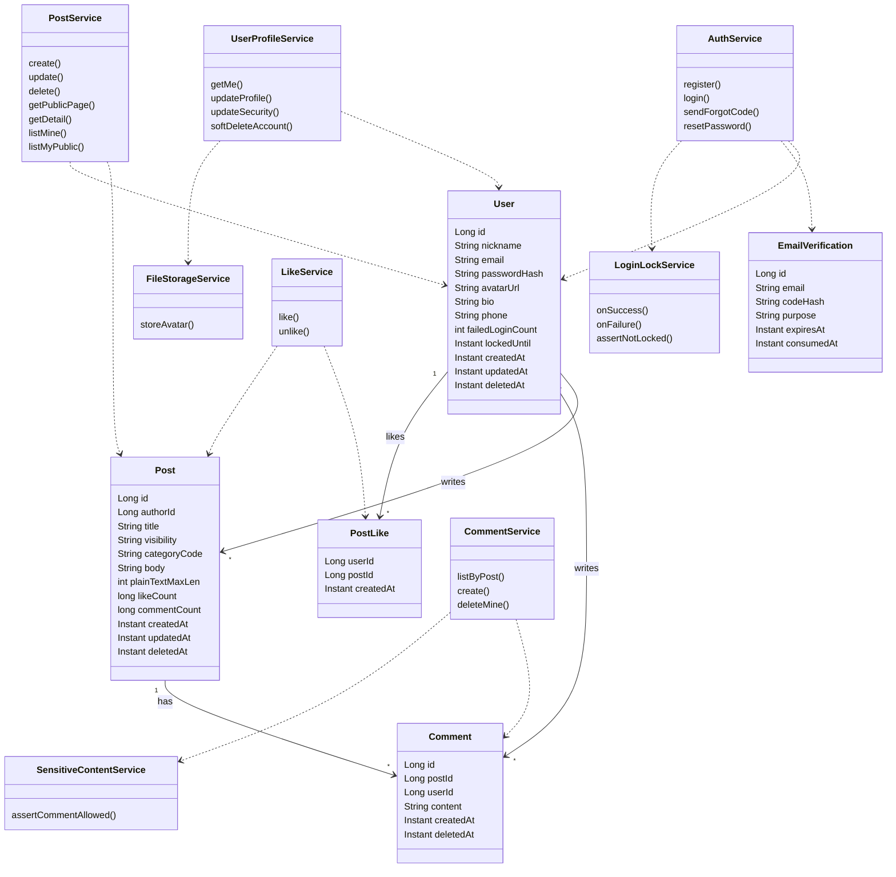
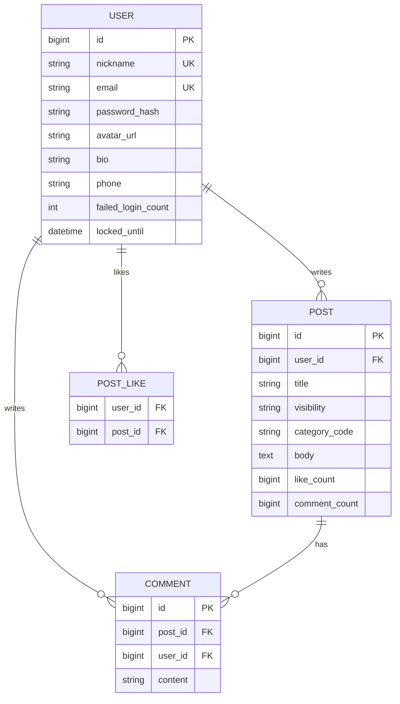

# 博客后端技术设计 v1

本文档依据 [博客后端需求v1.md](./博客后端需求v1.md) 编写，作为后端**建表、接口契约、模块划分**的单一事实来源（SSOT）。实现栈与当前仓库 [blog-demo](../) 对齐：**Spring Boot 2.7、MySQL、Spring Data JPA、Spring Security + JWT、统一 Result 响应**。

---

## 1. 概述

### 1.1 与 PRD 的对应关系

| PRD 章节 | 设计覆盖范围 |
|----------|----------------|
| 一、产品概述 | 本期范围、二期边界（管理员、转发等） |
| 二、用户角色与权限 | 鉴权矩阵、公开/私密数据访问规则 |
| 三、业务流程 | 接口编排顺序（注册→登录→业务） |
| 四、功能需求 4.1–4.19 | 表字段、校验、REST 接口、错误码 |

### 1.2 二期与预留

- **管理员、内容审核、系统配置**：二期（PRD 1.4），本期不建表、不暴露接口。
- **转发（1.2）**：二期；本期可在 `post` 预留扩展字段或忽略，不强制接口。
- **第三方登录**：预留配置位，本期不实现。

### 1.3 技术栈约定

- **运行时**：Java 8+，Spring Boot 2.7.x。
- **持久化**：**MySQL 5.7.x**，InnoDB，UTF8MB4（与当前 `application.properties` 中 `MySQL57Dialect` 一致）。
- **安全**：BCrypt 存密码；登录态使用 **JWT**（见 1.4）。
- **API 风格**：REST + JSON；日期时间 ISO-8601 或 `yyyy-MM-dd HH:mm:ss`（全文统一一种并在接口表中注明）。
- **统一响应**：`{ "code": number, "msg": string, "data": any }`（与现有 `Result` 一致）。

### 1.4 登录态：Cookie 与 JWT 的等价方案（PRD 4.2）

PRD 要求「Cookie 保存登录态、有效期 2 天」。与现有前后端 Bearer 方案兼容的两种等价实现：

| 方案 | 做法 | 推荐 |
|------|------|------|
| **A. HttpOnly Cookie** | 登录成功后 `Set-Cookie: access_token=...; HttpOnly; Secure; SameSite=Lax; Max-Age=172800`；服务端从 Cookie 读 JWT；前端不写 localStorage。 | 更贴近 PRD 字面；需 CORS `allowCredentials` + 前端 axios `withCredentials`。 |
| **B. Authorization Bearer** | JWT 放 `Authorization: Bearer`；`exp` 为 2 天（172800s）。 | **与当前 blog-demo / blog-web 一致**，改动最小。 |

**本设计推荐方案 B** 作为一期落地；方案 A 在「安全加固」迭代中可切换（`JwtAuthenticationFilter` 同时解析 Header 与 Cookie 即可）。

---

## 2. 需求澄清（与 PRD 原文冲突处理）

| 问题 | 原文位置 | 处理结论 |
|------|-----------|----------|
| 游客能否看文章详情与评论 | 第二章允许游客看公开详情；4.12、4.13 写「非登录不能查看」 | **以第二章为准（已评审确认）**：`visibility=open` 的文章，**游客可** `GET /posts/{id}` 与 `GET /posts/{id}/comments`；`only_myself` **仅作者**可见详情与评论列表。 |
| 4.17「获取用户信息」与公开主页 | 4.17 要求登录才可取「邮箱、手机等」 | 拆分为 **`GET /users/me`（登录全量）** 与 **`GET /users/{id}/public-profile`（游客/登录均可，仅公开字段 + 公开文章分页）**，避免与第二章「公开个人主页」矛盾。 |
| 4.10 编辑未写「分类」 | 4.9 含分类 | **编辑接口包含 `categoryCode`**，与前端「博客前端需求 v1」及数据一致性对齐。 |
| PRD 章节号重复 | 两个 4.17 / 两个 4.18 | 本设计按语义映射为：**点赞 / 取消点赞**、**当前用户资料**、**公开博客列表**。 |

---

## 3. PRD 功能点与接口/表映射总表

| PRD | 功能 | 主要接口 | 主要表/实体 |
|-----|------|-----------|-------------|
| 4.1 | 注册 | `POST /auth/register` | `user` |
| 4.2 | 登录 + 锁定 + 2 天 | `POST /auth/login` | `user` |
| 4.3 | 退出 | `POST /auth/logout` | 无状态 JWT：客户端删 Token 即可；可选服务端黑名单表（二期） |
| 4.4 | 忘记密码 | `POST /auth/forgot-password/send-code`、`POST /auth/forgot-password/reset` | `email_verification` |
| 4.5 | 资料与头像 | `PUT /users/me/profile` | `user` |
| 4.6 | 邮箱与密码 | `PUT /users/me/security` | `user` |
| 4.7 | 注销 | `DELETE /users/me` | `user.deleted_at` 软删 |
| 4.8 | 上传头像 | `POST /users/me/avatar` | 文件系统 + 回写 `user.avatar_url` |
| 4.9 | 新建文章 | `POST /users/me/posts` | `post` |
| 4.10 | 编辑文章 | `PUT /users/me/posts/{id}` | `post` |
| 4.11 | 我的博客列表 | `GET /users/me/posts` | `post` |
| 4.12 | 文章详情 | `GET /posts/{id}` | `post` |
| 4.13 | 评论列表 | `GET /posts/{id}/comments` | `comment` + `user` |
| 4.14 | 发表评论 | `POST /posts/{id}/comments` | `comment` |
| 4.15 | 删评论 | `DELETE /users/me/comments/{id}` | `comment` |
| 4.16 | 删文章 | `DELETE /users/me/posts/{id}` | `post` |
| 4.17/4.18 点赞 | 点赞/取消 | `POST /posts/{id}/like`、`DELETE /posts/{id}/like` | `post_like`、`post.like_count` |
| 4.17 用户信息 | 当前用户全量 | `GET /users/me` | `user` |
| 4.18 公开列表 | 首页列表 | `GET /posts/public` | `post` + `user` |
| 4.19 | 当前用户公开文列表 | `GET /users/me/posts/public` 或 `GET /users/me/posts?visibility=open` | `post` |

说明：**4.11** 返回「我的」全部文章（含 `only_myself`）；**4.19** 仅返回当前用户 `visibility=open` 的文章，字段与 PRD「标题、类型、更新时间、正文」对齐，建议 `data.list[].summary` 为摘要字段（正文过长时列表返回摘要或截断策略见接口表）。

---

## 4. 领域模型与类图

### 4.1 聚合与职责

- **User 聚合**：注册、登录锁定、资料、安全、注销、头像 URL。
- **Post 聚合**：创建/更新/删除、可见性、分类、正文；维护 `like_count`、`comment_count`（**强一致：在点赞/评论事务内同步更新**，实现简单；高并发下再引入异步校准任务）。
- **Comment**：依附 Post；删除为软删或硬删（推荐软删 `deleted_at` 以保留审计）。
- **PostLike**：用户与文章多对多关联行；唯一约束 `(user_id, post_id)`。
- **EmailVerification**：忘记密码短时验证码（哈希存储）。

### 4.2 类图（Mermaid）



---

## 5. 数据库表定义

### 5.1 ER 图（Mermaid）



### 5.2 枚举与字典

**文章可见性 `post.visibility`**

| 值 | 含义 |
|----|------|
| `open` | 公开 |
| `only_myself` | 仅自己可见 |

**文章分类 `post.category_code`**

| code | 含义 |
|------|------|
| `1` | 后端 |
| `2` | 前端 |
| `3` | Android |
| `4` | iOS |
| `5` | 人工智能 |
| `6` | 工具开发 |
| `7` | 阅读 |

**列表「状态」中文（4.11）**：由 `visibility` 派生：`open` → `公开`，`only_myself` → `仅自己可见`（接口直接返回中文或返回枚举由前端映射，推荐 **后端返回中文 `statusLabel`** 与 PRD 一致）。

### 5.3 DDL（MySQL 5.7，UTF8MB4）

以下 DDL 按 **MySQL 5.7** 编写（InnoDB、utf8mb4）。

**与 5.7 相关的约定**

- **时间类型**：`DATETIME(6)` 与 `CURRENT_TIMESTAMP(6)` / `ON UPDATE CURRENT_TIMESTAMP(6)` 在 **MySQL 5.6.5+** 可用，5.7 环境可直接执行。若你方实例较旧，可改为 `DATETIME`（秒精度）并去掉 `(6)`。
- **不支持部分唯一索引**：5.7 **没有** MySQL 8 的「带 `WHERE` 条件的唯一索引」。手机号「非空才唯一」依赖：`UNIQUE KEY (phone)` 下 **多条 `NULL` 合法**（InnoDB），**非空手机号**仍唯一；若需更严语义，在应用层更新前做 `SELECT` 校验。
- **全文检索**：InnoDB 在 5.7 已支持 **FULLTEXT**；一期仍推荐 `LIKE` 起步，数据量大再上 FULLTEXT 或 ES。
- **行格式**：建议表使用 `ROW_FORMAT=DYNAMIC`（配合 `innodb_file_format=Barracuda` 等 5.7 常见配置），避免 utf8mb4 长字段索引长度问题。

```sql
-- 用户表
CREATE TABLE `user` (
  `id` BIGINT NOT NULL AUTO_INCREMENT,
  `nickname` VARCHAR(20) NOT NULL COMMENT '登录昵称，唯一',
  `email` VARCHAR(128) NOT NULL COMMENT '邮箱，唯一',
  `password_hash` VARCHAR(255) NOT NULL COMMENT 'BCrypt',
  `avatar_url` VARCHAR(512) NULL,
  `bio` VARCHAR(50) NULL COMMENT '个人简介 8-50 字由应用层校验',
  `phone` VARCHAR(20) NULL COMMENT '可选；非空时唯一见应用层或唯一索引',
  `failed_login_count` INT NOT NULL DEFAULT 0,
  `locked_until` DATETIME(6) NULL COMMENT '锁定截止时间，NULL 表示未锁定',
  `created_at` DATETIME(6) NOT NULL DEFAULT CURRENT_TIMESTAMP(6),
  `updated_at` DATETIME(6) NOT NULL DEFAULT CURRENT_TIMESTAMP(6) ON UPDATE CURRENT_TIMESTAMP(6),
  `deleted_at` DATETIME(6) NULL COMMENT '注销软删',
  PRIMARY KEY (`id`),
  UNIQUE KEY `uk_user_nickname` (`nickname`),
  UNIQUE KEY `uk_user_email` (`email`),
  KEY `idx_user_deleted` (`deleted_at`)
) ENGINE=InnoDB DEFAULT CHARSET=utf8mb4 COLLATE=utf8mb4_unicode_ci ROW_FORMAT=DYNAMIC;

-- 手机号：唯一索引下多条 NULL 合法（选填手机）；非空值互斥唯一
CREATE UNIQUE INDEX `uk_user_phone` ON `user` (`phone`);

-- 文章表
CREATE TABLE `post` (
  `id` BIGINT NOT NULL AUTO_INCREMENT,
  `user_id` BIGINT NOT NULL,
  `title` VARCHAR(120) NOT NULL COMMENT '应用层限制 4-30 字',
  `visibility` VARCHAR(20) NOT NULL COMMENT 'open / only_myself',
  `category_code` VARCHAR(2) NOT NULL COMMENT '1-7',
  `body` MEDIUMTEXT NOT NULL COMMENT '富文本 HTML/Markdown 原样存',
  `like_count` BIGINT NOT NULL DEFAULT 0,
  `comment_count` BIGINT NOT NULL DEFAULT 0,
  `created_at` DATETIME(6) NOT NULL DEFAULT CURRENT_TIMESTAMP(6),
  `updated_at` DATETIME(6) NOT NULL DEFAULT CURRENT_TIMESTAMP(6) ON UPDATE CURRENT_TIMESTAMP(6),
  `deleted_at` DATETIME(6) NULL,
  PRIMARY KEY (`id`),
  UNIQUE KEY `uk_post_author_title` (`user_id`, `title`),
  KEY `idx_post_public_list` (`visibility`, `category_code`, `updated_at`),
  KEY `idx_post_user` (`user_id`, `updated_at`),
  CONSTRAINT `fk_post_user` FOREIGN KEY (`user_id`) REFERENCES `user` (`id`)
) ENGINE=InnoDB DEFAULT CHARSET=utf8mb4 COLLATE=utf8mb4_unicode_ci ROW_FORMAT=DYNAMIC;

-- 评论表
CREATE TABLE `comment` (
  `id` BIGINT NOT NULL AUTO_INCREMENT,
  `post_id` BIGINT NOT NULL,
  `user_id` BIGINT NOT NULL,
  `content` VARCHAR(300) NOT NULL,
  `created_at` DATETIME(6) NOT NULL DEFAULT CURRENT_TIMESTAMP(6),
  `deleted_at` DATETIME(6) NULL,
  PRIMARY KEY (`id`),
  KEY `idx_comment_post` (`post_id`, `created_at`),
  CONSTRAINT `fk_comment_post` FOREIGN KEY (`post_id`) REFERENCES `post` (`id`),
  CONSTRAINT `fk_comment_user` FOREIGN KEY (`user_id`) REFERENCES `user` (`id`)
) ENGINE=InnoDB DEFAULT CHARSET=utf8mb4 COLLATE=utf8mb4_unicode_ci ROW_FORMAT=DYNAMIC;

-- 点赞表
CREATE TABLE `post_like` (
  `user_id` BIGINT NOT NULL,
  `post_id` BIGINT NOT NULL,
  `created_at` DATETIME(6) NOT NULL DEFAULT CURRENT_TIMESTAMP(6),
  PRIMARY KEY (`user_id`, `post_id`),
  KEY `idx_like_post` (`post_id`),
  CONSTRAINT `fk_like_user` FOREIGN KEY (`user_id`) REFERENCES `user` (`id`),
  CONSTRAINT `fk_like_post` FOREIGN KEY (`post_id`) REFERENCES `post` (`id`)
) ENGINE=InnoDB DEFAULT CHARSET=utf8mb4 COLLATE=utf8mb4_unicode_ci;

-- 忘记密码验证码（示例：存哈希；明文仅短信/邮件通道展示）
CREATE TABLE `email_verification` (
  `id` BIGINT NOT NULL AUTO_INCREMENT,
  `email` VARCHAR(128) NOT NULL,
  `code_hash` VARCHAR(128) NOT NULL,
  `purpose` VARCHAR(32) NOT NULL COMMENT 'RESET_PASSWORD',
  `expires_at` DATETIME(6) NOT NULL,
  `consumed_at` DATETIME(6) NULL,
  `created_at` DATETIME(6) NOT NULL DEFAULT CURRENT_TIMESTAMP(6),
  PRIMARY KEY (`id`),
  KEY `idx_email_verif_email` (`email`, `purpose`, `expires_at`)
) ENGINE=InnoDB DEFAULT CHARSET=utf8mb4 COLLATE=utf8mb4_unicode_ci ROW_FORMAT=DYNAMIC;
```

**索引与搜索说明（4.18 标题模糊）**

- 一期：`LIKE %keyword%` + `visibility='open'`，数据量可控时足够。
- 优化：MySQL **FULLTEXT**（`title`）或接入 Elasticsearch（二期）。

**`uk_user_phone` 说明**：InnoDB 下 `UNIQUE(phone)` 允许多行 `phone IS NULL`，满足「手机选填」；**非空**手机号仍受唯一约束。5.7 无法用部分索引表达「仅非空唯一」，更复杂规则请用**触发器**或**应用层事务内校验**。

---

## 6. 分页与排序约定

| 项 | 约定 |
|----|------|
| 页码 | `page`，**从 1 开始**；默认 `1`。 |
| 每页条数 | `size`，默认 **10**，最大 **50**（可配置）。 |
| 排序 | 列表默认 `updatedAt,desc`；公开列表与「我的博客」一致。 |
| 响应包装 | `data: { "total": long, "list": [...] }` 或 Spring `Page` 序列化字段统一为 `total` + `list`。 |

---

## 7. REST 接口定义

**鉴权列说明**

- **匿名**：不携带 Token。
- **登录**：有效 JWT（方案 B：`Authorization: Bearer`）。

**通用错误**：HTTP 200 + `code != 200`（与现有全局异常风格一致）；敏感接口可额外返回 HTTP 401。

### 7.1 认证与用户

| 路径 | 方法 | 鉴权 | 请求体 | 响应 data | 业务 code / 说明 |
|------|------|------|--------|-------------|------------------|
| `/auth/register` | POST | 匿名 | `{ nickname, email, password }` | `{ userId }` 或空 | 400 昵称/邮箱重复、格式错误 |
| `/auth/login` | POST | 匿名 | `{ nickname, password }` | `{ token, tokenType, userId, nickname }` | 401 密码错误；423 或 403 **账号锁定**；404 用户不存在 |
| `/auth/logout` | POST | 登录 | 无 | `ok` | 401 未登录 |
| `/auth/forgot-password/send-code` | POST | 匿名 | `{ email }` | `{ cooldownSec? }` | 404 邮箱不存在；429 发送过频 |
| `/auth/forgot-password/reset` | POST | 匿名 | `{ email, code, newPassword }` | `ok` | 400 验证码错误/过期 |
| `/users/me` | GET | 登录 | - | 用户全量（昵称、邮箱、头像、简介、手机） | 401 |
| `/users/me/profile` | PUT | 登录 | `{ nickname, bio, phone?, avatarUrl? }` | 更新后用户 | 400 校验；409 手机占用 |
| `/users/me/security` | PUT | 登录 | `{ email, currentPassword, newPassword }` | `ok` | 400 当前密码错误；409 邮箱占用 |
| `/users/me` | DELETE | 登录 | 可选 `{ confirmEmail }` 与 PRD 校验 | `ok` | 401；软删用户 |
| `/users/me/avatar` | POST | 登录 | `multipart/form-data` file | `{ url }` | 400 类型不符；413 过大 |
| `/users/{id}/public-profile` | GET | 匿名 | - | `{ nickname, avatarUrl, bio, posts: Page }` 仅公开文 | 404 用户不存在或已注销 |

### 7.2 文章（公开 + 我的）

| 路径 | 方法 | 鉴权 | 查询参数 / 体 | 响应 data | 说明 |
|------|------|------|----------------|-------------|------|
| `/posts/public` | GET | 匿名 | `categoryCode?`, `q?`, `page`, `size` | 分页列表：标题、昵称、分类、更新时间、点赞数、评论数、**摘要/正文片段** | PRD 4.18「博客中文」映射为 `excerpt` 或 `contentPreview` |
| `/posts/{id}` | GET | 匿名 | - | 详情：标题、更新时间、正文、分类、点赞数 | `only_myself` 且非作者 → 403 或 404 |
| `/users/me/posts` | GET | 登录 | `q?`, `page`, `size` | 分页：标题、`statusLabel`、更新时间 | PRD 4.11 |
| `/users/me/posts/public` | GET | 登录 | `page`, `size` | 分页：标题、分类、更新时间、正文/摘要 | PRD 4.19 |
| `/users/me/posts` | POST | 登录 | `{ title, visibility, categoryCode, body }` | `{ id }` | 400 校验；409 同用户标题重复 |
| `/users/me/posts/{id}` | PUT | 登录 | 同创建 + 分类 | 更新后对象 | 403 非本人；409 标题与其它文冲突 |
| `/users/me/posts/{id}` | DELETE | 登录 | - | `ok` | 403 非本人 |

### 7.3 评论与点赞

| 路径 | 方法 | 鉴权 | 请求体 | 响应 data | 说明 |
|------|------|------|--------|-------------|------|
| `/posts/{id}/comments` | GET | 匿名 | `page`, `size` | 列表：昵称、头像、时间、内容 | 文章为 `only_myself` 且非作者 → 403 |
| `/posts/{id}/comments` | POST | 登录 | `{ content }` | 新评论 | 400 长度/敏感词；401 未登录 |
| `/users/me/comments/{commentId}` | DELETE | 登录 | - | `ok` | 仅删除自己的评论；403 |
| `/posts/{id}/like` | POST | 登录 | 无 | `{ likeCount }` | 幂等：已点赞不报错或返回当前计数 |
| `/posts/{id}/like` | DELETE | 登录 | 无 | `{ likeCount }` | 未点赞不报错 |

### 7.4 Spring Security 白名单（与 blog-demo 对齐）

以下路径建议 **permitAll**（匿名可访问）：

- `POST /auth/register`、`POST /auth/login`、`POST /auth/forgot-password/**`
- `GET /posts/public`、`GET /posts/{id}`、`GET /posts/{id}/comments`
- `GET /users/*/public-profile`（按最终实现路径调整 Ant 匹配）
- Swagger /error /OPTIONS（与现有 [SecurityConfig](../src/main/java/com/example/spring1/config/SecurityConfig.java) 一致）

其余接口 **authenticated**。

---

## 8. 业务规则摘要（校验）

| 场景 | 规则 |
|------|------|
| 注册昵称 | 4–20，字母开头，`[A-Za-z][A-Za-z0-9_]{3,19}` |
| 注册密码 | 8–20，须同时含字母与数字 |
| 登录 | 昵称存在、密码匹配；失败 `failed_login_count++`，**≥10** 则设置 `locked_until`（如锁定 30 分钟，可配置）；成功清零 |
| 资料昵称/简介/手机 | 同 PRD 4.5；手机非空时唯一 |
| 安全邮箱/密码 | 同 PRD 4.6；改邮箱后需重新登录（可选策略） |
| 文章标题 | 4–30 字符；**同一用户**标题唯一 |
| 正文 | 富文本存储；**纯文本长度 ≤ 5000**（去 HTML 标签后计数） |
| 评论 | 1–300 字；敏感词校验 |
| 头像文件 | png/jpg/jpeg；大小上限如 2MB |

---

## 9. 错误码约定（与 `Result` / `BusinessException`）

建议在 `BusinessException` 或枚举中统一维护：

| code | 场景 |
|------|------|
| 200 | 成功 |
| 400 | 参数校验、格式错误、敏感词 |
| 401 | 未登录、Token 无效 |
| 403 | 无权限（如私密文非作者） |
| 404 | 资源不存在 |
| 409 | 唯一约束冲突（昵称、邮箱、标题、手机号） |
| 423 | 账号锁定（登录失败过多，可与 403 区分） |
| 429 | 验证码发送过频 |
| 500 | 系统异常 |

`msg` 必须对用户可读（与 PRD「明确提示」一致）。

---

## 10. 头像存储（PRD 4.8）

- **目录**：应用工作目录下 `user_logo_images/`（可通过 `application.properties` 配置绝对路径）。
- **命名**：`user_logo_{yyyyMMddHHmmss}_{seq}.{ext}`，`seq` 为进程内或当日递增序列（可用 DB 序列表或原子长整型保证唯一）。
- **URL**：对外返回如 `/files/user-logo/{filename}`，由 `ResourceHandler` 或 Nginx 静态映射提供访问；生产建议对象存储（二期）。

---

## 11. 安全与非功能

- **密码**：BCrypt，禁止明文落库。
- **JWT**：`exp`=172800 秒（2 天）；密钥长度满足 HS256；HTTPS 部署。
- **CORS**：与 blog-web 域名、`withCredentials`（若用 Cookie 方案）一致。
- **XSS**：富文本存库由前端净化 + 后端可选二次白名单（二期）；列表摘要建议后端截断纯文本。
- **限流**：登录、发验证码接口建议 IP + 邮箱限流（网关或 Bucket4j）。

---

## 12. 与现有 blog-demo 工程映射与演进

| 现状 | 演进方向 |
|------|----------|
| 表 `user` 仅 `username`、`password`、`create_time` | 迁移为本文 `user` 全字段：`username` 列可重命名为 `nickname` 或保留列名映射为昵称 |
| [AuthController](../src/main/java/com/example/spring1/controller/AuthController.java) 注册/登录 | 扩展 DTO 字段（email）；登录入参由 username 改为 nickname 与 PRD 一致 |
| [JwtAuthenticationFilter](../src/main/java/com/example/spring1/security/JwtAuthenticationFilter.java) | 白名单增加 `GET /posts/**` 中匿名可读子集（避免整棵 `/posts` 放开导致误暴露管理接口） |
| [Result](../src/main/java/com/example/spring1/common/Result.java)、[GlobalExceptionHandler](../src/main/java/com/example/spring1/common/GlobalExceptionHandler.java) | 保留；补充 `BusinessException` 与 HTTP 状态策略文档化 |
| 包名 `com.example.spring1` | 新模块建议 `com.example.blog.*` 或逐步重构，不在本期强制 |

**建议包结构（新代码）**

```
com.example.blog
├── controller      // Auth, User, Post, Comment, Like, File
├── service
├── repository
├── entity
├── dto
├── enums           // Visibility, CategoryCode
├── security        // 复用或迁移现有 JWT 组件
└── config
```

---

## 13. 文档修订记录

| 版本 | 日期 | 说明 |
|------|------|------|
| v1 | 2026-04-13 | 首版：表、ER、类图、接口、错误码、与 PRD/工程映射 |
| v1.1 | 2026-04-13 | 持久化目标库明确为 **MySQL 5.7**；DDL 章节补充 5.7 限制与 `uk_user_phone` 说明；建表统一 `ROW_FORMAT=DYNAMIC` 以利 utf8mb4 索引 |

---

*本文档路径：`doc/博客后端技术设计v1.md`*
